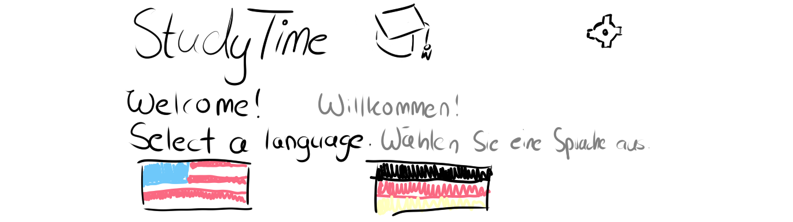
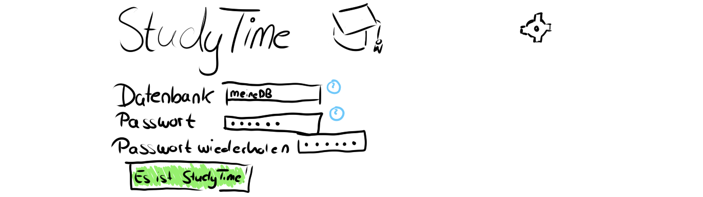

# Semesterprojekt GIS WS24: StudyTime Web-Version
## Autor
Daniel Benjamin Georg (277 055)  

## Projektidee
Eine Web-Version basiert auf ein vorherigen Projekt namens [StudyTime](https://github.com/SootDan/StudyTime). Das Projekt wird als Web-Applikation mit NodeJS komplett neu geschrieben.  
Die App wird benutzt zum Produktivitätsmanagement eines Studiensemesters. Man kann eine Deadline setzen. Setzt man eine Deadline, wird einem vorgegeben, wie viele Stunden pro Tag/Woche/Monat noch gelernt werden muss. Die Statistiken richten sich am SPO. Man kann jedoch auch eine StudyTime-Datenbank für persönliche Zwecke einsetzen.  
Es wird gerechnet, wie viel Lernzeit dieses Semester noch benötigt wird. Man kann aus mehreren SQL-Datenbanken auswählen; sie sind passwortgeschützt, damit andere User nicht die Daten von anderen verändern können.  
Man darf die Sprache entweder auf Deutsch oder Englisch setzen; die Settings werden in einem Cookie gespeichert.  

## User Experience
Am Anfang wählt der User eine Sprache aus. Diese wird als Cookie gespeichert, aber kann wieder geändert werden.  
    

Der Einfachheit wegen werden die Skizzen nur noch in der deutschen Sprache erscheinen; die englische Sprache ist weiterhin eine Möglichkeit.  
Nach Auswahl der Sprache wird man in eine Art Login-Screen weitergeleitet. Jedoch speichert StudyTime keine Accounts, sondern passwortgeschützte Datenbanken.  
  
Oben rechts kann mit einem Klick auf das Zahnrad die Sprache angepasst werden.    

Klickt der User auf den unteren Link *("Datenbank")*, wird dieser auf eine Art Datenbankregistrierung weitergeleitet. Es wird nach einem Datenbanknamen und einem Passwort gefragt. Es wird validiert, ob eine Datenbank mit diesem Namen schon existiert (in dem Fall wird die Checkbox rot) und ob sie über 12 oder unter 3 Zeichen lang ist. Ebenso wird validiert, ob die Passwörter über 4 und unter 16 Zeichen lang und identisch sind. Die Passwörter werden verschlüsselt in einer für User unzugängliche Datenbank gespeichert. Eventuell können diese mittels RegEx auf illegale Zeichen überprüft werden.  
  
Im Rahmen der Userfreundlichkeit werden diese Kriterien mittels Klick an den blauen Fragezeichen rechts erläutert.  
Nach diesem Prozess wird der User auf den Login-Screen weitergeleitet, wo dieser nun seine gewählten Daten eingeben kann.  

Sobald der User seine Datenbank betritt, werden einem die Statistiken der gewählten Fächer und Interessen gezeigt. Der User kann mit einem Klick auf das jeweilige Fach den Namen und die (evtl. noch nicht vorhandene) Deadline editieren. Ebenso kann der User zusätzliche Zeit hinzufügen.  

Wenn der User dies will, zeigt StudyTime auch einen "Streak" an, wie viele Tage er hintereinander gelernt hat.  